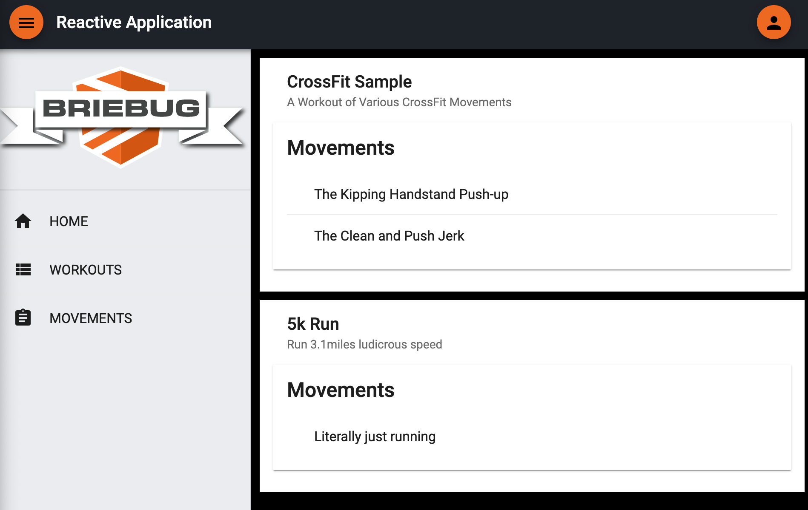

# Workout Dashboard

This project was generated using [Nx](https://nx.dev).



## App Description

This is the 7th of 8 Accelerated Angular LevelUp Applications.
It aims to show a more complex feature set/data model for a fully reactive, unit tested, E2E tested, well architected Angular application.

Specifically, this dashboard app features CRUD functionality on two entities - Workouts and Movements...

```json
"workouts": [
    {
      "id": "69550e9f-f8ef-480d-8318-f2670e414389",
      "title": "CrossFit Sample",
      "description": "A Workout of Various CrossFit Movements",
      "movements": [
        {
          "id": "8cc1aae2-4919-442f-a7f7-1d82efa2ade2",
          "title": "The Kipping Handstand Push-up",
          "description": "Do a vertical push-up",
          "workoutId": "69550e9f-f8ef-480d-8318-f2670e414389"
        },
        {
          "id": "21a4beb5-6bf0-4ce1-aa00-cd19e0da9b85",
          "title": "The Clean and Push Jerk",
          "description": "Clean the weight and shove it above your head.. Sounds safe.",
          "workoutId": "69550e9f-f8ef-480d-8318-f2670e414389"
        }
      ]
    }
]
```

Create your own workouts and add as many painful movements as you like.

## See It Live

[Visit Workout Dashboard](https://levelup-angular-07-workouts.surge.sh/)

## Getting Started

Run `npm install`.

## Development server

Run `npm run serve:all` for a dev server and to run the json-server api. Navigate to http://localhost:4200/. The app will automatically reload if you change any of the source files.

## Build

Run `ng build dashboard` to build the project. The build artifacts will be stored in the `dist/` directory. Use the `--prod` flag for a production build.

## Understand your workspace

Run `nx dep-graph` to see a diagram of the dependencies of your projects.
